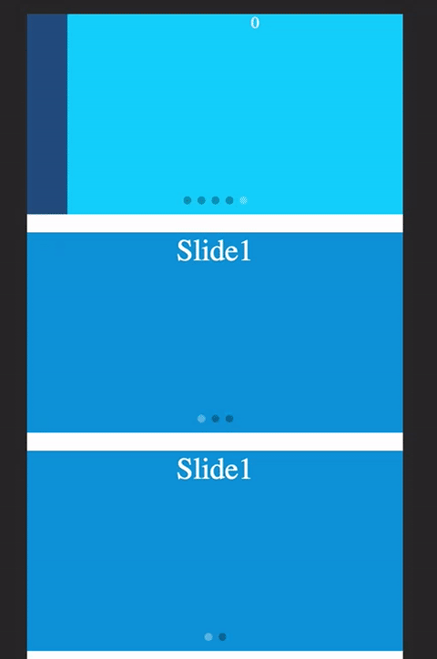

# vue-swiper

> Another vue-swipe

## Build Setup

``` bash
# install dependencies
npm install

# serve with hot reload at localhost:8080
npm run dev

# build for production with minification
npm run build

# 打包出单独的组件
npm run component
```

> vue-swiper 是一款移动端图片轮播组件，代码实现参考了[vue-swipe](https://github.com/ElemeFE/vue-swipe)的一些思路，并针对它的缺点自己做了些优化

### 它最主要的缺点有两个：

 1.  左右切换时出现怪异情况，如下图

 

 2.  当手势左右滑动时应该禁止上下滚动，反之当上下滚动时禁止触发轮播图左右滑动

### 下面是vue-swiper的效果

  1.  左右切换

  

  2.  进一步改善体验
